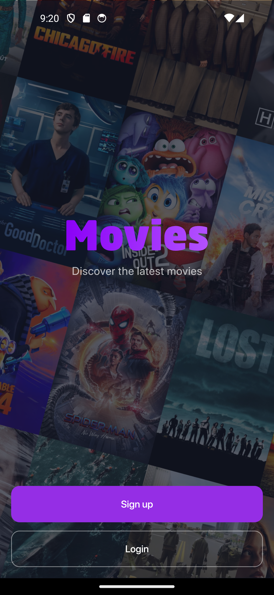
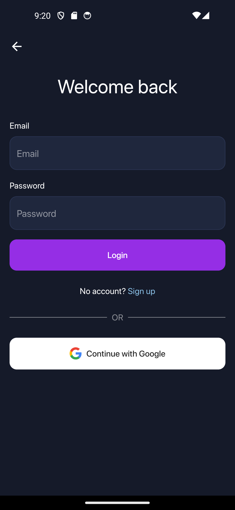
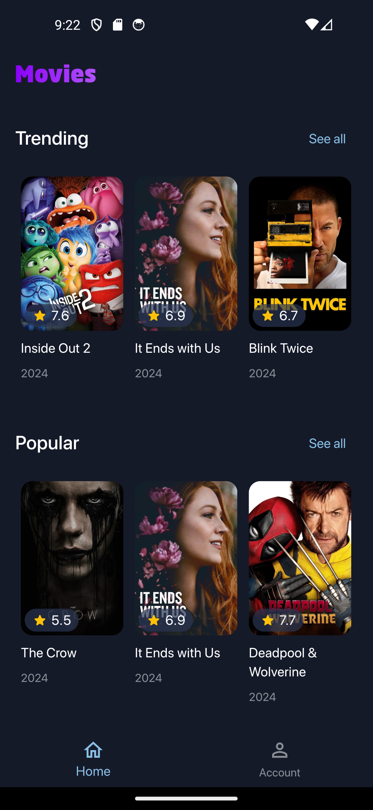
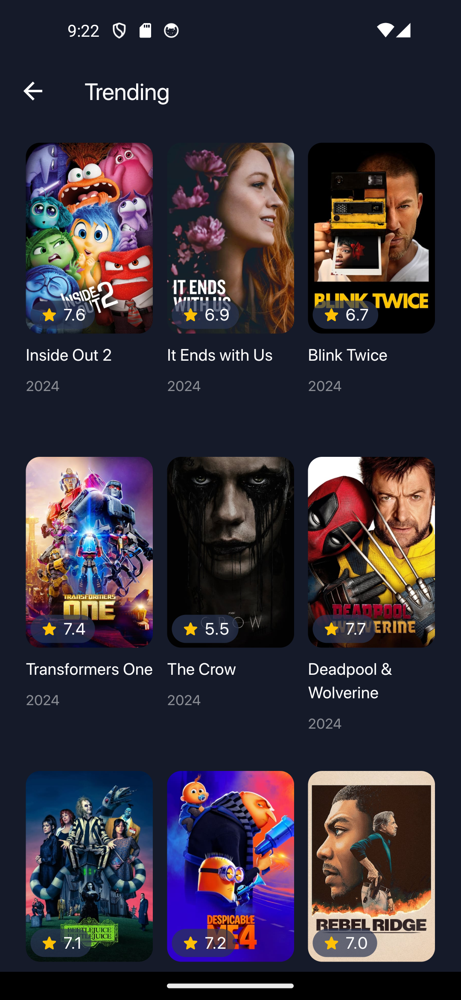
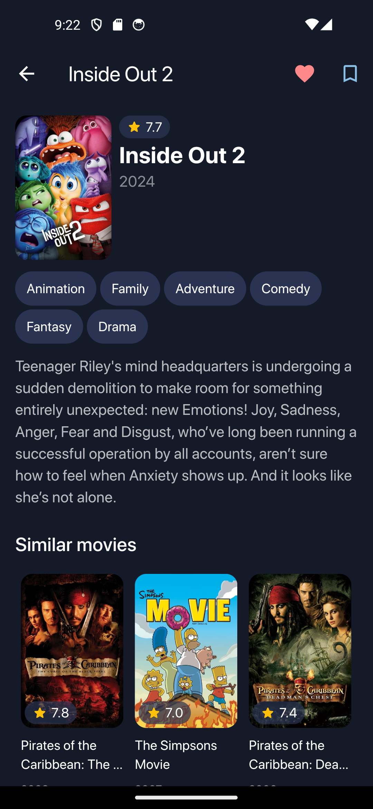
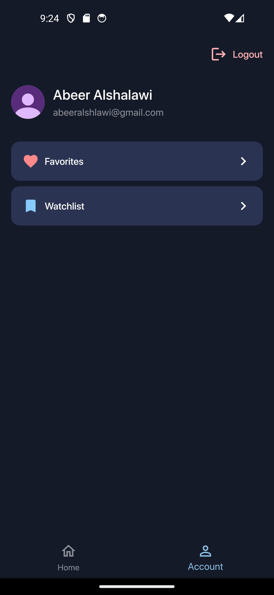
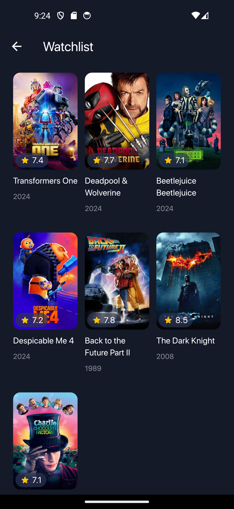

# Movie App

A movie app made with Flutter, Firebase, and [TMDB API](https://developer.themoviedb.org/reference/intro/getting-started).

## Screenshots
  
  
 

## Features
- Authenticate with email or a Google account
- Browse trending, popular, and movies currently playing in theatres
- See movie details including rating, release year, genres, overview, and similar movies
- Add movies to favotites or watchlist

## Tech Stack
- **Flutter:** Used for the front-end.
- **Firebase Authentication:** Handles user authentication.
- **Cloud Firestore:** Stores account data including favorites and watchlist.
- **TMDB API:** Provides the movie data consumed by the app.
- **Riverpod:** Manages state and handles API calls.

## Installation
1. Clone this repository
   ```
   git clone https://github.com/AbeerAlshalawi/movie-app.git
   ``` 
3. Get your API key from [TMDB](https://developer.themoviedb.org/reference/intro/getting-started) and add it to this line in lib/src/core/api.dart
   ```
   final String _apiKey = 'YOUR_API_KEY';
   ```
5. Create a Firebase project and configure it to use Firebase Authentication and Firestore Database
